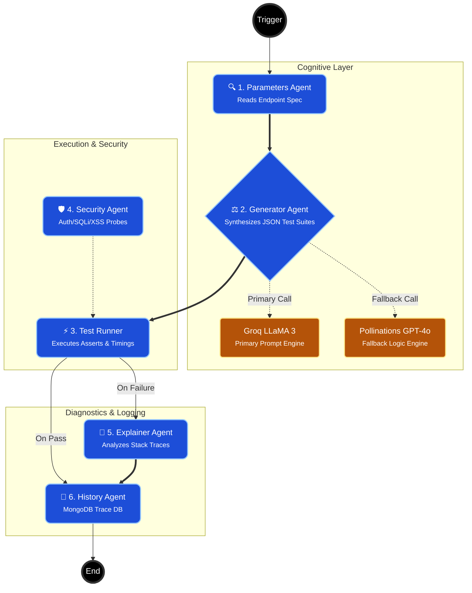
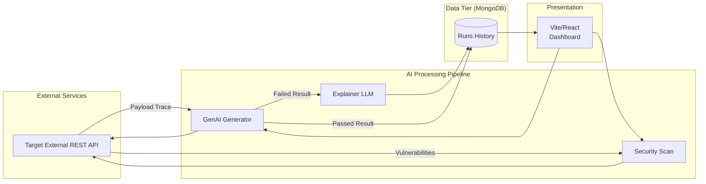

# ⚡ AgentIQ
Enterprise API Intelligence & Autonomous Testing
An AI pipeline that watches enterprise APIs 24/7, generates dynamic test cases, detects security vulnerabilities, and analyzes failures independently — with human oversight for mission-critical endpoints.
🚀 Developer Platform: Built with React, Vite, Express, and Groq/Pollinations AI.

---

## The Problem — Why This Exists
Imagine you are the QA Lead for an enterprise suite possessing hundreds of internal and external APIs. Your engineering team builds tests manually — hundreds of them every sprint. They check structural validity, boundary conditions, edge cases, and basic security flaws. On a good sprint, they achieve about 70% coverage. But here is the problem: an undocumented edge case or an unauthenticated endpoint might bypass the suite completely until it fails in production.

The leakage is technical, continuous, and compounding.
Industry data shows that enterprises lose significant engineering bandwidth to writing and maintaining API tests, while simultaneously exposing themselves to critical vulnerabilities like SQLi, XSS, and IDOR on newly developed endpoints. 

The Critical Gap: No existing tool combines dynamic AI-generated test scaffolding + autonomous security assessment + historical failure reasoning in a unified dashboard. AgentIQ unifies these capabilities into an AI-orchestrated system that runs continuously, tests autonomously, and records results comprehensively.

## What AgentIQ Does — Solution Overview
AgentIQ is an autonomous AI testing agent system. It is not just a dashboard showing pass/fail metrics; it is an active participant in your enterprise QA operations that generates tests, detects problems, reasons about causes, and provides immediate actionable insights.
1. **Generates Cases**: Interrogates the target endpoint description intelligently to automatically construct varied payloads using Amazon/Mistral (or Pollinations AI) LLMs.
2. **Executes Autonomously**: Invokes the tests against the live endpoint dynamically.
3. **Detects Anomalies**: Autonomously scans for authentication bypasses, SQL Injectability, and XSS parameter reflection on demand.
4. **Reasons & Synthesizes**: Interprets raw JSON failure responses and translates them into plain-English root cause analyses.
5. **Maintains Compliance**: Logs every single test run to a MongoDB audit history.

## The Agentic AI Pipeline — Deep Dive
Each function in the AgentIQ pipeline leverages distinct execution services to handle varying cognitive steps.

### ⚙️ Engine Execution Flow
1. **Node Execution**: The AI generator takes in your target URL, endpoint method, and functionality description. It leverages a fallback-robust LLM architecture to synthesize 4 deterministic, boundary-tested REST payloads.
2. **Conditional Validation**: The Test Runner evaluates the generated payloads against the target returning normalized status, latency, and assertions.
3. **Reasoning State**: If a payload fails its assertion, a secondary AI chain is triggered to "Explain Failure", passing the raw request context, expected assertion, and actual server error.



## Data Flow Diagram (DFD)


## Tech Stack — Full Table
| Layer | Technology | Primary Purpose |
|------|-----------|-----------------|
| **Frontend** | React 18 / Vite 5 | SPA Presentation, fast HMR |
| **State** | Zustand / TanStack Query | Stores sessions & auto-retries requests |
| **Styling** | Tailwind CSS / Recharts | Component design & Analytics plotting |
| **Backend** | Express / Node.js 22 | Routing requests & agentic delegation |
| **LLM Tier** | Groq / Pollinations | Core inference & reasoning mechanisms |
| **Auth** | Passport.js (Google) | JWT Session issuance & validation |
| **Database** | MongoDB / Mongoose | Immutable run audits & credentials |

## Project File Structure
```
AgentIQ/
├── frontend/                 # React UI Layer
│   ├── src/
│   │   ├── components/       # Reusable UI parts & loaders
│   │   ├── constants/        # Mocks, Maps, UI configs
│   │   ├── hooks/            # Generic custom hooks
│   │   ├── pages/            # 10+ core domain routes
│   │   ├── routes/           # Protected routing logic
│   │   ├── services/         # Axios wrapper & endpoints
│   │   └── store/            # Zustand persistent states
├── backend/                  # API Engine Layer
│   ├── src/
│   │   ├── controllers/      # Route logic handlers
│   │   ├── lib/              # Connectors (MongoDB)
│   │   ├── middlewares/      # Interceptors & JWT decoding
│   │   ├── models/           # Mongoose object schemas
│   │   ├── routes/           # Definition maps
│   │   ├── services/         # AI execution, test running, security
│   │   └── utils/            # Shared logic formatting
└── package.json              # Orchestrates workspaces
```

## Dashboard Pages
- **`/` (Command Center)**: The narrative overview and direct agent prompt trigger.
- **`/dashboard`**: Real-time overview of the system, plotting pulses using Recharts and vulnerability cards.
- **`/test`**: Fully-fledged execution desk allowing parameterized setups invoking dynamic generation arrays + split views for API Trace Results.
- **`/security`**: Vulnerability detector sending XSS/SQLi injection payloads actively mapped out to a timeline.
## Setup & Installation
```bash
# 1. Clone & Install
git clone https://github.com/adarshcod30/AgentIQ-Platform.git
cd AgentIQ-Platform

# 2. Run Root Installer (installs frontend, backend, root workspace)
npm run install:all

# 3. Configure Local Environment
# Go to frontend folder
cd frontend
cp .env.example .env

# Configure your backend .env
cd ../backend
cp .env.example .env # Ensure your MongoDB URI and API keys are set

# 4. Start the Application Pipeline
cd ..
npm run dev
# Vite runs on http://localhost:5173
# Express runs on http://localhost:3001
```

## Environment Variables Reference

### Backend `.env`
| Variable | Description |
|----------|-------------|
| `PORT` | API port (default: 3001) |
| `MONGO_URI` | Standard MongoDB connection string |
| `GOOGLE_CLIENT_ID` | OAuth Client ID for SSO |
| `GOOGLE_CLIENT_SECRET` | OAuth Client Secret for SSO |
| `JWT_SECRET` | Encryption secret for session tokens |
| `GROQ_API_KEY` | Primary inference key for Llama-3 parsing |
| `NEW_GEMINI_API_KEY` | Auxiliary processing mechanism |

### Frontend `.env`
| Variable | Description |
|----------|-------------|
| `VITE_API_URL` | Express target (`http://localhost:3001`) |
| `VITE_APP_NAME` | Config (e.g. `AgentIQ`) |
| `VITE_SHOW_FALLBACK_BANNER` | Set to true to utilize Anthropic offline fallbacks |

## Simulation Scenarios / Testing Modules
AgentIQ uses dynamic configuration payload wrappers to support various simulation methodologies:
- `Functional Assessment`: Checks pure status metrics dynamically analyzing query parameters.
- `Security Vulnerability`: Performs hard-coded probing of headers and response injections.
- `AI Failure Diagnostic`: Sends payloads directly violating parameters to trigger error strings for LLM assessment.

## API Reference
| Method | Endpoint | Description |
|--------|----------|-------------|
| POST | `/api/ai/generate` | Generates JSON-form test suites given description |
| POST | `/api/tests/run` | Triggers test execution assertions |
| POST | `/api/security/scan` | XSS / SQLi assessment triggers |
| GET | `/api/history` | Fetches JSON paginated run histories |
| GET | `/api/auth/google` | Redirectional hook to Passport.js flow |

## Contributing & License
We love to collaborate on extending this framework further. Contributions standard via fork & pull request branches alongside accompanying testing.

This software is provided "AS IS", completely open-sourced to encourage iterative optimization against the complex nature of software regression and API lifecycle leakages.

## Acknowledgements
- Designed and built for robust structural API testing.
- Utilizing Groq (Llama-3-8B) alongside Pollinations proxy infrastructure to maintain consistent parsing logic in the LLM Tier.
