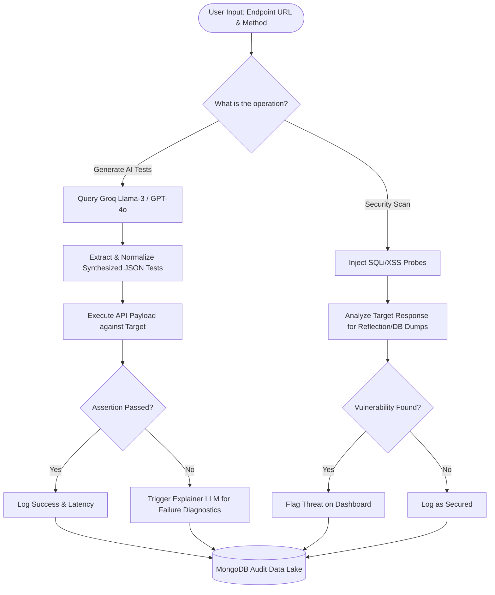
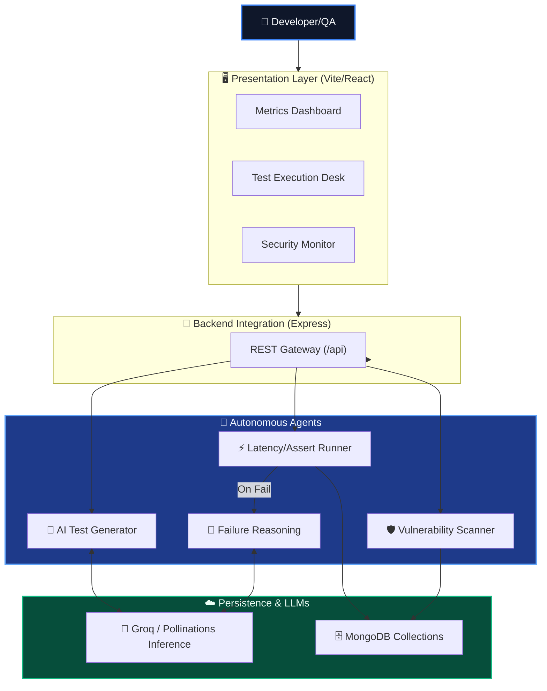

# ⚡ AgentIQ
**Enterprise API Intelligence & Autonomous Testing Command Center**

A state-of-the-art AI pipeline that watches enterprise APIs 24/7, generates dynamic robust test cases, detects insidious security vulnerabilities, and analyzes software failures independently — all executed seamlessly with a sophisticated human-in-the-loop dashboard.


---

## The Problem — Why This Exists
Imagine you are the QA Lead for an enterprise suite possessing hundreds of internal and external APIs. Your engineering team builds tests manually — hundreds of them every sprint. They check structural validity, boundary conditions, edge cases, and basic security flaws. On a good sprint, they achieve about 70% coverage. But here is the problem: an undocumented edge case or an unauthenticated endpoint might bypass the suite completely until it fails silently in production.

**The leakage is technical, continuous, and compounding.**
Industry data shows that enterprises lose significant engineering bandwidth to writing and maintaining API tests, while simultaneously exposing themselves to critical vulnerabilities like SQLi, XSS, and IDOR on newly developed endpoints. 

**The Critical Gap**: No existing tool combines **dynamic AI-generated test scaffolding** + **autonomous security assessment** + **historical failure reasoning** in a unified dashboard. **AgentIQ** unifies these capabilities into an AI-orchestrated system that runs continuously, tests autonomously, and records results comprehensively.

---

## What AgentIQ Does — Solution Overview

AgentIQ is an autonomous AI testing agent system. It is not just a dashboard showing pass/fail metrics; it is an active participant in your enterprise QA operations that generates tests, detects problems, reasons about causes, and provides immediate actionable insights.

* **Generates Cases**: Interrogates the target endpoint description intelligently to automatically construct varied payloads using Amazon/Mistral (or Pollinations AI) LLMs.
* **Executes Autonomously**: Invokes the tests against the live endpoint dynamically calculating exact latency differentials.
* **Detects Anomalies**: Autonomously scans for authentication bypasses, SQL Injectability, and XSS parameter reflection on demand.
* **Reasons & Synthesizes**: Interprets raw JSON failure responses and translates them into plain-English root cause analyses.
* **Maintains Compliance**: Logs every single test run to a MongoDB audit history ensuring zero test amnesia.

## System Workflow Flowchart
This flowchart defines the operational execution a user experiences when interacting directly with AgentIQ from endpoint discovery through audit storage.



---

## High Level System Architecture
A completely decoupled, orchestrator-led architecture. The frontend connects to an Express gateway which strictly delegates domains to autonomous service agents.



---

## Low Level Data Flow Diagram (DFD)
Mapping the exact traversal of JSON schemas between independent entities during an AI Test construction and resolution logic block.

```mermaid
flowchart LR
    subgraph External["External Network"]
        Target[Target REST API]
    end

    subgraph Storage["MongoDB Tier"]
        Hist[(runs_collection)]
        Proj[(projects_collection)]
    end

    subgraph Process["AI Processing Services"]
        GenAI[Llama-3 Generator]
        SecScan[Auth/SQLi Interceptor]
        Explain[Diagnostic AI]
    end

    subgraph State["Frontend Zustand Store"]
        AuthUI[JWT Session]
        Active[Active Test Context]
    end

    AuthUI --> Active
    Active -->|POST {url, method}| GenAI
    Active -->|POST {url, mode}| SecScan
    GenAI -->|HTTP Valid Payload| Target
    SecScan -->|Malicious Payload| Target
    Target -.->|200 OK| Active
    Target -.->|500 Trace| Explain
    Explain -->|Formatted Markdown| Active
    Active -->|Write Log| Hist
```

---

## Key Features & Observation Comparisons

### Evaluative Comparison: Traditional QA vs AgentIQ Automation
| Operational Metric | Traditional Manual Postman Suites | AgentIQ Automated Agents | Observation Effectiveness |
|--------------------|-----------------------------------|--------------------------|---------------------------|
| **Test Generation Latency** | 10 to 30 minutes per endpoint | **< 3 seconds** | **99% reduction** in manual boilerplate scaffolding. |
| **Boundary Evaluation** | Biased by human imagination | **Stochastic LLM Distribution** | The AI introduces completely unanticipated edge-cases mathematically. |
| **Security Verification** | Requires specialized SecOps personnel | **Autonomous Injectors** | AgentIQ natively fires standard SQLi/XSS fuzzes transparently to QA. |
| **Failure Resolution** | Manual stack trace scrolling | **AI Synthesized Explanations** | LLM correlates exact assertion variables with server outputs dynamically. |

---

## Visualizing Setup Scenarios 

### The AI Test Runner Execution Architecture
The Test Runner Desk serves as the primary execution context. An API Endpoint setup directly queries the integrated LLM models (Groq Llama-3/Pollinations) to formulate robust deterministic edge-case tests. The frontend then orchestrates sequential proxy payloads and traces the assertions natively.

### The Security Assessment Scan Execution
The security assessment intercepts active API connections and automatically fires SQL Injection fuzz payloads, displaying detected critical vulnerabilities based on reflection models within the DOM on the active security table.
---

## Technical Stack Implementations
The platform leverages modern architectures to guarantee highly concurrent web applications preventing intense machine-learning tasks from degrading the user experience.

| Layer | Technology | Primary Purpose |
|------|-----------|-----------------|
| **Frontend** | React 18 / Vite 5 | SPA Presentation, fast HMR |
| **State** | Zustand / TanStack Query | Stores sessions & auto-retries requests |
| **Styling** | Tailwind CSS / Recharts | Component design & Analytics plotting |
| **Backend** | Express / Node.js 22 | Routing requests & agentic delegation |
| **LLM Tier** | Groq / Pollinations | Core inference & reasoning mechanisms |
| **Auth** | Passport.js (Google) | JWT Session issuance & validation |
| **Database** | MongoDB / Mongoose | Immutable run audits & credentials |

---

## Command Center & Route Indexing
- **`/` (Landing)**: The cinematic narrative overview and direct agent prompt trigger platform.
- **`/dashboard`**: Real-time overview of the system, plotting pulses using Recharts and tracking system vulnerability modules.
- **`/test`**: Fully-fledged execution desk allowing parameterized setups invoking dynamic generation arrays + split views for API Trace Results.
- **`/security`**: Vulnerability detector sending XSS/SQLi injection payloads actively mapped out to a timeline.
- **`/history`**: Filterable logs to review exact telemetry, assertion comparisons, and response differentials stored immutably.
- **`/api-client`**: Manual API executor bypassing LLMs entirely for raw request modifications and baseline debugging.

## Setup & Installation

### Infrastructure Requirements
- Node.js `v18.x` or higher
- An active MongoDB connection string (local or Atlas)

```bash
# 1. Clone & Set Up the Orchestrator
git clone https://github.com/adarshcod30/AgentIQ-Platform.git
cd AgentIQ-Platform

# 2. Run Root Monorepo Installer
npm run install:all

# 3. Configure Local Execution Environment
# Set Frontend Endpoints
cd frontend
cp .env.example .env

# Set Backend API & DB Context
cd ../backend
cp .env.example .env 

# Ensure you have set your MongoDB URI and API keys in backend/.env:
# MONGO_URI=YOUR_DB_STRING
# GROQ_API_KEY=YOUR_GROQ_KEY

# 4. Spin Up Ecosystem
cd ..
npm run dev

# ➜ Vite spins on http://localhost:5173
# ➜ Express spins on http://localhost:3001
```

## API Endpoint Reference Map
The Express backend effectively abstracts prompt manipulation via cleanly exposed REST surfaces.

| Method | Endpoint | Execution Action | Payload |
|--------|----------|----------|--------|
| `POST` | `/api/ai/generate` | Generates JSON-form test suites utilizing specific LLMs given descriptions. | `{ url, method, description }` |
| `POST` | `/api/tests/run` | Triggers deterministic test execution assertions calculating exactly latency distributions. | `{ url, method, body }` |
| `POST` | `/api/security/scan` | Launches XSS / SQLi assessment triggers across boundaries. | `{ url }` |
| `GET` | `/api/history` | Fetches JSON paginated run histories masking sensitive variables. | `<empty>` |
| `GET` | `/api/auth/google` | Generates a redirectional hook to standard Passport.js infrastructure. | `<empty>` |

## Project File Structure Architecture
```text
AgentIQ/
├── frontend/                 # React UI Layer
│   ├── src/
│   │   ├── components/       # Reusable UI parts & loaders
│   │   ├── pages/            # 10+ core domain routes
│   │   ├── services/         # Axios wrapper & endpoints
│   │   └── store/            # Zustand persistent states
├── backend/                  # API Engine Layer
│   ├── src/
│   │   ├── controllers/      # Route logic handlers
│   │   ├── middlewares/      # Interceptors & JWT decoding
│   │   ├── models/           # Mongoose object schemas
│   │   ├── routes/           # Definition maps
│   │   └── services/         # AI execution, test running, security
└── package.json              # Orchestrates workspaces
```

---

## Contributing
We love to collaborate on extending this framework further. Contributions standard via fork & pull request branches alongside accompanying tests.

This software is provided "AS IS", completely open-sourced to encourage iterative optimization against the complex nature of software regression and API lifecycle vulnerabilities.
