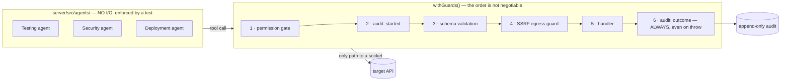

# AGENTIQ

**An agentic platform for API testing and security validation, where every outbound request
passes through a permission-checked, SSRF-guarded, audited tool layer.**

B.Tech final-year project · Semester 7 · Adarsh Dwivedi (23UCS509), LNMIIT Jaipur

---

## What it actually does

You give it an API endpoint and a sentence describing it. It:

1. **Generates executable test cases** with an LLM — multi-assertion, grounded in your OpenAPI
   spec when you supply one.
2. **Executes them** and decides pass or fail **deterministically**. The model proposes
   assertions; a tool evaluates them. The LLM never judges its own work.
3. **Probes six vulnerability families** (SQL injection, reflected XSS, broken authentication,
   CORS, security headers, rate limiting) using a baseline differential, so a finding requires a
   material deviation from benign behaviour rather than a suspicious-looking string.
4. **Explains failures** in plain English — time-boxed and best-effort, never blocking a run.
5. **Deploys to Render and then tests what it just deployed**, attaching the result to the
   deployment record.

Every one of those steps reaches the network only through an MCP tool. That is the contribution.

### What it is not

It is not a monitoring product, it does not watch anything continuously, and it does not replace
a security audit. It detects **indicators** on endpoints you point it at and tell it you are
authorised to test. See [Known limitations](#known-limitations) — that section is not boilerplate.

---

## The architecture, and why it is shaped this way

The central claim is that **an agent never performs I/O.** It may only call a registered tool.


```mermaid
flowchart LR
  subgraph agents["server/src/agents/ — NO I/O, enforced by a test"]
    T[Testing agent]
    S[Security agent]
    D[Deployment agent]
  end

  subgraph guards["withGuards() — the order is not negotiable"]
    direction TB
    P[1 · permission gate] --> A1[2 · audit: started]
    A1 --> V[3 · schema validation]
    V --> E[4 · SSRF egress guard]
    E --> H[5 · handler]
    H --> A2[6 · audit: outcome — ALWAYS, even on throw]
  end

  agents -->|"tool call"| guards
  guards -->|"only path to a socket"| NET[(target API)]
  A2 --> DB[(append-only audit)]
```

**Why MCP rather than plain function calls.** A function call is a convention; you defend it with
discipline, and discipline erodes over fifteen weeks of edits. Routing every side effect through a
registry gives one choke point where permission, validation, SSRF checking and auditing are applied
by construction. `server/tests/architecture.test.js` fails the build if `axios`, `fetch` or
`node:http` appears under `agents/`, `controllers/` or `routes/` — so the claim is mechanical, not
aspirational. It has already caught a real hole (see the git history for `request.routes.js`).

**Why the LLM never decides pass/fail.** If the model both writes the assertion and judges it, a
green run means the model was self-consistent, not that the API is correct. `run_test_case`
evaluates assertions deterministically and reports the expected and actual value for each one.

**Risk classes, not per-tool prompts.** Grants are per *risk class* and per *host*, because asking
someone to approve nine tools individually is theatre — they will click through it. Asking them to
approve "this app may send attack-indicator payloads to `api.example.com`" is a decision a human
can actually make. `network.probe` is never auto-granted under any configuration.

### The nine tools

| Tool | Risk class | What it does |
| --- | --- | --- |
| `http_request` | `network.read` | One HTTP request. Every other network tool builds on it. |
| `run_test_case` | `network.read` | Executes a case and evaluates its assertions deterministically. |
| `parse_openapi` | `local.compute` | YAML/JSON in, dereferenced operations out. No network. |
| `probe_headers` | `network.read` | Security-header analysis. |
| `probe_cors` | `network.read` | CORS misconfiguration, including wildcard-with-credentials. |
| `probe_sqli` | `network.probe` | SQLi indicators against a benign baseline, with DB fingerprints. |
| `probe_xss` | `network.probe` | Reflected-XSS indicators, escaping-aware. |
| `probe_auth` | `network.probe` | Three requests — valid, **tampered**, anonymous. |
| `deploy_service` | `deploy.write` | Render deployment. Grant **and** per-action confirmation. |

The tampered request in `probe_auth` is the discriminator that kills the false positive: a public
endpoint ignores a forged token, a broken one accepts it. Combined with the user's
`intendedPublic` declaration, this is why the false-positive rate below is what it is.

---

## Quickstart

Five minutes from a fresh clone, with no code edits.

**Prerequisites:** Node 22 (`.nvmrc` pins it), a MongoDB connection string
([Atlas M0](https://www.mongodb.com/cloud/atlas/register) is free), and one LLM provider.

```bash
git clone https://github.com/B-TechProject/AGENTIQ.git
cd AGENTIQ
nvm use            # or: fnm use
npm install
```

```bash
cp .env.example .env
```

Fill in the three that matter. Everything else has a working default:

| Variable | How to get it |
| --- | --- |
| `MONGO_URI` | Atlas → Connect → Drivers. Add `0.0.0.0/0` to the IP access list. |
| `JWT_SECRET` | `node -e "console.log(require('crypto').randomBytes(48).toString('base64url'))"` |
| `BEDROCK_MODEL_ID` + AWS credentials | Or set `GROQ_API_KEY` instead — either provider works alone. |

The server validates every variable at boot, prints a set/missing table, and **exits non-zero**
rather than starting half-configured.

```bash
npm run dev
```

- API → <http://localhost:3001/api/health>
- Web → <http://localhost:5173>

Register an account, then point it at the bundled fixtures:

```bash
npm run fixtures
```

That starts a **deliberately vulnerable** API on `:4001` and a **hardened** one on `:4002` with an
identical contract. Scan both. The first should light up; the second should report nothing.
(Local fixtures live on loopback, which the egress guard blocks by design — set
`ALLOW_PRIVATE_TARGETS=true` in `.env` for local work. It is refused outright when
`NODE_ENV=production`, and it can never unlock the cloud metadata range.)

```bash
npm test            # 434 tests
npm run evaluate    # regenerates docs/90_EVALUATION.md — costs about $0.004
```

---

## Evaluation

Full methodology and results: **[docs/90_EVALUATION.md](docs/90_EVALUATION.md)**, regenerated by
`npm run evaluate`. Raw observations are committed in `evaluation/results/`.

Measured against two fixture applications with identical routes, seed data and response
contracts, differing only in their defects — so a finding on one and not the other can only be
explained by the defect.

| | Result |
| --- | --- |
| Security detection | **16 TP · 0 FP · 0 FN** across 48 labelled observations |
| Precision / recall | **100% / 100%** |
| **False positives on the hardened app** | **0%** |
| Mutation score (spec-grounded) | **50.0%** — 3 repeats, range 50–50% |
| Mutation score (description-only) | **43.3%** — range 40–50% |
| Cost of a full evaluation run | **$0.004** · 522 audited tool invocations |

**The grounding result is honest rather than flattering.** Grounded won 2 and tied 1 of 3 paired
repeats — suggestive, in the direction the design predicted, and *not* significant at that sample
size. The report says so.

**Three mutants neither arm ever killed:** the generator never asserts `content-type`, never
writes a 404 negative case, and never verifies filter correctness. That is a concrete limitation
with a concrete fix, and it is in the report because a clean sweep would have been less
informative.

For contrast, the Semester 6 evaluation was five GET requests against `jsonplaceholder` with a
near-tautological pass rate.

---

## API reference

All routes are under `/api`. Everything except `/health` and `/auth/*` requires
`Authorization: Bearer <token>`.

| Method | Route | Purpose |
| --- | --- | --- |
| `GET` | `/health` | Liveness, Mongo status, and the **resolved** LLM chain per task. |
| `POST` | `/auth/register` · `/auth/login` | Local auth. Google OAuth when configured. |
| `GET` | `/mcp/tools` | The registry, with JSON Schemas **generated** from the Zod definitions. |
| `GET` | `/mcp/audit` | Append-only audit log. Filter by outcome, tool, run. |
| `GET`·`POST`·`DELETE` | `/mcp/grants` | Session grants, per risk class and host. |
| `ALL` | `/mcp` | Streamable-HTTP MCP transport for external clients. |
| `POST` | `/runs` | Start a run. Returns the persisted run in its terminal state. |
| `GET` | `/runs` · `/runs/:id` · `/runs/stats` | History, detail, dashboard aggregates. |
| `POST` | `/security/scan` | Scan without generating functional tests. |
| `POST` | `/specs/import` | Import an OpenAPI spec by URL or upload. |
| `POST` | `/request/send` | The API client — guarded, permission-checked, audited. |
| `POST` | `/deployments` · `/deployments/preflight` | Deploy, or check whether a deploy would work. |

There is also a stdio MCP entrypoint (`npm --workspace server run mcp:stdio`) that speaks the same
JSON-RPC handshake Claude Desktop uses.

---

## Known limitations

Stated plainly, because a tool that overstates what it checked is worse than one that checks less.

1. **A clean scan is not a guarantee of security.** Six families are covered. Business-logic flaws,
   IDOR, race conditions, SSRF *in the target*, and anything requiring multi-step state are not.
2. **The rate-limit family reports an indicator, not a demonstration.** Eight successful requests
   do not prove there is no limiter — a generous limit permits them too. It is scored MEDIUM for
   exactly that reason.
3. **`intendedPublic` is a user declaration, and it is load-bearing.** Mark a genuinely protected
   endpoint as public and the authentication family will correctly report nothing.
4. **Two fixture applications are not a population.** Every figure in the evaluation describes that
   benchmark. It is a floor for "does this work at all", not an estimate of real-world performance.
5. **The mutation score uses response-boundary mutants**, not source-level ones. That is the right
   unit for a black-box API suite, but the numbers are not comparable to a classical mutation
   testing paper.
6. **Generation is stochastic.** Each evaluation arm runs three times and reports mean and range.
   Three runs is enough to catch noise masquerading as a finding; it is not a significance test.
7. **Post-deploy verification is partial by design.** It runs the functional suite plus the
   read-only security families. `sqli`, `xss` and `auth` send attack payloads and are never
   auto-granted, so they are skipped — and the UI says which and why.
8. **Grants are in-memory and session-scoped.** They do not survive a restart. That is deliberate:
   a permission that outlives the session it was given in is the unaccountable-automation problem
   this project exists to avoid.
9. **Only scan what you own or are authorised to test.** The tool sends real attack-indicator
   payloads at whatever host you nominate.

---

## Project layout

```
server/          Express API, MCP registry and tools, agents, egress guard
  src/mcp/       the tool layer — registry, permissions, audit, SSRF guard
  src/agents/    testing, security, deployment — NO I/O, enforced by a test
web/             React 19 + Vite 8 + Tailwind v4
fixtures/        vulnerable-api and hardened-api — identical contract, by construction
evaluation/      the harness that produces Chapter 4
docs/            PRD, TRD, app flow, UI spec, AWS architecture, evaluation
```

## Documentation

| | |
| --- | --- |
| [docs/01_PRD.md](docs/01_PRD.md) | What is being built and why, with acceptance criteria |
| [docs/02_TRD.md](docs/02_TRD.md) | Technical design |
| [docs/03_App_Flow.md](docs/03_App_Flow.md) | Screen-by-screen behaviour and the demo script |
| [docs/05_AWS_ARCHITECTURE.md](docs/05_AWS_ARCHITECTURE.md) | Hosting, and the measured LLM routing decision |
| [docs/90_EVALUATION.md](docs/90_EVALUATION.md) | Chapter 4 — generated, never hand-edited |
| [PROGRESS.md](PROGRESS.md) | Build log, including defects found and how |

## Licence

MIT. See [LICENSE](LICENSE).
